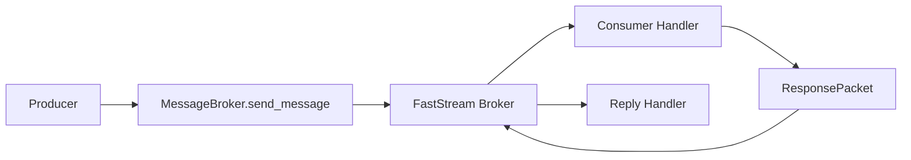

# lyik_messaging

`lyik_messaging` is a minimal messaging library built on FastStream.
It gives you a stable, strongly typed API for publish/subscribe and request/response workflows without exposing transport internals to app code.

## Key Features

- Transport abstraction behind a single `MessageBroker`
- Strict handler typing with early signature validation
- Transparent AES-GCM encryption support
- Minimal public API with predictable behavior
- Built-in request/response flow with `ResponsePacket`

## Installation

Install from PyPI:

```bash
pip install lyik_messaging
```

Install in editable mode (local development):

```bash
pip install -e .
```

## Quick Start

```python
import asyncio
from pydantic import BaseModel

from lyik_messaging import MessageBroker, MessageInfo


class Ping(BaseModel):
    text: str


broker = MessageBroker("redis://localhost:6379", queue_name="demo")


@broker.on_message("demo")
async def handle_ping(payload: Ping, info: MessageInfo) -> dict[str, str]:
    return {
        "echo": payload.text,
        "correlation_id": info.correlation_id or "",
    }


@broker.on_reply
async def handle_reply(response) -> None:
    print("reply status:", response.status)


async def main() -> None:
    await broker.connect()

    await broker.send_message({"text": "hello"}, sender="producer")

    # Keep consumers running
    await broker.start()


if __name__ == "__main__":
    asyncio.run(main())
```

## Core Concepts

### `MessageBroker`

The single entry point for connection lifecycle, publishing, subscriptions, and request/response operations.

### `DataPacket`

Transport-neutral request envelope used by packet handlers (`@broker.on_message` form).

### `ResponsePacket`

Standard response envelope returned by `send_and_wait` and reply handlers.

### `MessageInfo`

Metadata passed to strict handlers (`@broker.on_message("queue")`) when you request a second argument.

### Strict vs Packet Handlers

- Strict handler (`@broker.on_message("queue")`):
  - Signature: `(payload: BaseModel)` or `(payload: BaseModel, info: MessageInfo)`
  - Best when you want typed payload models per queue.
- Packet handler (`@broker.on_message`):
  - Signature: `(packet: DataPacket)`
  - Best when you want a transport-neutral envelope on the default queue.

## Message Flow



## Encryption Flow


## API Reference

### `MessageBroker`

```python
MessageBroker(
    uri: str,
    queue_name: str = "default_queue",
    *,
    aes_key: str | None = None,
    timeout: int = 5000,
    processing_timeout_ms: int | None = None,
    handler_max_retries: int = 0,
    retry_base_delay_ms: int = 100,
    retry_max_delay_ms: int | None = None,
    retry_jitter: bool = False,
    middlewares: list[Middleware] = [],
    observers: list[Observer-like] = [],
)
```

### `connect()`

Top-level helper:

```python
broker = await connect("redis://localhost:6379")
```

### `on_message`

Supported forms only:

- `@broker.on_message("queue")` for strict typed handlers
- `@broker.on_message` for packet handlers on the default queue

### `on_reply`

Registers response callback for `ResponsePacket`.

### `send_message`

Publishes a request payload and returns a correlation ID.

### `send_and_wait`

Publishes request and waits for a correlated response packet.

## Handler Examples

### Strict Handler Example

```python
from pydantic import BaseModel
from lyik_messaging import MessageInfo


class OrderCreated(BaseModel):
    order_id: str


@broker.on_message("orders.created")
async def handle_order(payload: OrderCreated, info: MessageInfo) -> dict[str, str]:
    return {"order_id": payload.order_id, "corr": info.correlation_id or ""}
```

### Packet Handler Example

```python
from lyik_messaging import DataPacket


@broker.on_message
async def handle_packet(packet: DataPacket) -> dict[str, str]:
    return {"sender": packet.sender}
```

## Retry Behavior

Only handler execution is retried. Decode/validation/parsing errors are not retried.

Backoff formula:

```text
delay = retry_base_delay_ms * (2 ** retry_index)
```

Configuration:

```python
broker = MessageBroker(
    "redis://localhost:6379",
    handler_max_retries=3,
    retry_base_delay_ms=100,
    retry_max_delay_ms=2000,
    retry_jitter=True,
)
```

## Project Structure

```text
src/
  lyik_messaging/
    __init__.py
    decorators.py
    encryption.py
    exceptions.py
    models.py
    utils.py
    broker/
      __init__.py
      core.py
      publisher.py
      consumer.py
      retry.py
      internal_types.py
```

## Adding a New Broker

1. Extend broker creation in `broker/core.py` (`BrokerCore._create_broker`).
2. Map URI scheme to the new FastStream broker implementation.
3. Ensure publish/request and subscribe semantics remain compatible.
4. Keep transport details inside `lyik_messaging`; do not leak FastStream types into app code.

Warning: If application code needs FastStream imports, abstraction is broken.

## Design Philosophy

- Minimal API surface
- Strict validation and fail-fast behavior
- Transport abstraction first
- Predictable defaults over hidden magic

## Troubleshooting

### Invalid handler signature

Error usually means handler is not one of:

- `(payload: BaseModel)`
- `(payload: BaseModel, info: MessageInfo)`
- `(packet: DataPacket)` for `@broker.on_message`

### AES key issues

`aes_key` must decode to 16, 24, or 32 bytes. Invalid key material raises `EncryptionError` at initialization.

### Not connected errors

If you see "Broker is not connected", call `await broker.connect()` before sending/publishing or use `await connect(...)`.
