# 🚀 message_broker — Enterprise Async Messaging Framework

> A transport-agnostic, asyncio-native messaging framework designed for **high-performance, scalable, and resilient distributed systems**.

---

## 📖 Overview

`message_broker` is a **production-grade messaging abstraction layer** that lets you build asynchronous, event-driven systems **without coupling your application to a specific broker**.

Instead of writing broker-specific code, you write against a **unified interface**, and the framework handles:

* connection management
* serialization
* retries & resilience
* backpressure
* observability
* broker capability differences

---

## 🎯 What It Solves

* Tight coupling to broker-specific APIs
* Inconsistent retry/error handling
* Lack of backpressure → memory crashes
* Hard-to-maintain messaging logic

✔️ Provides:

* clean abstraction layer
* pluggable adapters
* safe async processing
* enterprise-level features out of the box

---

## ✨ Core Features

* 🔌 **Pluggable Broker Adapters** (Redis, extensible)
* ⚡ **Async-first architecture** (`asyncio` native)
* 🧠 **Backpressure-aware consumers**
* 🔁 **Retry with exponential backoff**
* 📡 **Observability hooks (OpenTelemetry ready)**
* 🧩 **Middleware system**
* 🧱 **Strict typing & schema validation**
* ⏰ **Built-in delayed delivery support**
* 🔄 **Built-in RPC (request-response pattern)**

---

## 📦 Installation

```bash
git clone https://github.com/SanjitKamath/Message_Broker.git
cd message_broker

python -m venv .venv
source .venv/bin/activate   # Windows: .\.venv\Scripts\activate

pip install -e .

# Optional (OpenTelemetry)
pip install -e .[otel]
```

---

## ⚡ Quick Example

```python
import asyncio
from message_broker import MessageBroker

async def main():
    broker = MessageBroker("redis://127.0.0.1:6379")

    @broker.on_message
    async def handle(data):
        print(data.content)
        return {"status": "ok"}

    await broker.start()

asyncio.run(main())
```

---

# 🧩 Architecture Overview

```
Producer
  ↓
Message(payload)
  ↓
serialize (JSON)
  ↓
Adapter publish
  ↓
Queue / Redis list / delay system
  ↓
Subscriber receives
  ↓
deserialize → Message
  ↓
middleware.after_consume
  ↓
your handler(message)
```

---

# ✨ How it Works

```mermaid
flowchart TD

%% =========================
%% PRODUCER FLOW
%% =========================

subgraph PRODUCER [Producer Flow]
    P1["Your Code: send_message or send_and_wait"]

    P2["broker.py: MessageBroker.__init__"]
    P3["core/context.py: BrokerContext - parse URI"]
    P4["core/registry.py: BrokerRegistry.create"]
    P5["Adapter: Broker instance - Redis, RabbitMQ, etc."]

    P6["broker.py: connect()"]
    P7["Adapter: establish connection"]
    P8["Adapter: get_publisher"]

    P9["broker.py: send_message or send_and_wait"]
    P10["broker.py: build and publish packet"]

    P11["schema.py: DataPacket creation"]
    P12["core/interfaces.py: Message creation"]
    P13["core/interfaces.py: correlation_id injection"]

    P14["core/interfaces.py: EnforcingPublisher"]
    P15["core/observability.py: before_publish middleware"]

    P16{"Delayed delivery?"}
    P17["core/interfaces.py: ScheduledEnvelope"]

    P18["core/resilience.py: with_retries"]
    P19["core/serializers.py: serialize message"]

    P20["Adapter Publisher: publish()"]
    P21["Underlying Broker System"]

    P1 --> P2 --> P3 --> P4 --> P5
    P5 --> P6 --> P7 --> P8
    P8 --> P9 --> P10
    P10 --> P11 --> P12 --> P13
    P13 --> P14 --> P15

    P15 --> P16
    P16 -- Yes --> P17 --> P18
    P16 -- No --> P18

    P18 --> P19 --> P20 --> P21
end

%% =========================
%% BROKER / QUEUE
%% =========================

subgraph BROKER [Broker Queue System]
    Q1["Message stored in queue"]
    Q2["Optional scheduler for delayed messages"]

    Q1 --> Q2
end

P21 --> Q1

%% =========================
%% CONSUMER FLOW
%% =========================

subgraph CONSUMER [Consumer Flow]
    C1["Your Code: on_message handler"]

    C2["broker.py: on_message()"]
    C3["broker.py: make message wrapper"]

    C4["broker.py: connect()"]
    C5["Adapter: connect and get subscriber"]

    C6["Adapter Subscriber: subscribe()"]
    C7["Adapter: receive message"]

    C8["core/serializers.py: deserialize"]
    C9["core/interfaces.py: Message reconstruction"]

    C10["core/observability.py: after_consume middleware"]

    C11["broker.py: wrapper(msg)"]
    C12["schema.py: DataPacket creation"]

    C13["broker.py: idempotency and validation"]
    C14["broker.py: execute user handler"]

    C15{"Reply required?"}
    C16["broker.py: publish response"]
    C17["Re-enter Producer Flow"]
    C18["End"]

    C1 --> C2 --> C3
    C3 --> C4 --> C5
    C5 --> C6 --> C7

    C7 --> C8 --> C9 --> C10
    C10 --> C11 --> C12
    C12 --> C13 --> C14

    C14 --> C15
    C15 -- Yes --> C16 --> C17
    C15 -- No --> C18
end

Q1 --> C7
```



## 📂 Folder Structure

```text
message_broker/
├── src/
│   ├── adapters/
│   │   ├── __init__.py
│   │   └── redis.py            # Redis implementation
│   │
│   ├── core/
│   │   ├── __init__.py
│   │   ├── context.py          # Connection parsing + config merging
│   │   ├── exceptions.py       # Custom exceptions
│   │   ├── interfaces.py       # Contracts (Publisher, Subscriber, Broker)
│   │   ├── observability.py    # Middleware + tracing
│   │   ├── registry.py         # Adapter registration system
│   │   ├── resilience.py       # Retry logic
│   │   └── serializers.py      # Serialization layer
│   │
│   ├── __init__.py
│   ├── app_logging.py          # Logging setup
│   ├── broker.py               # High-level API (MessageBroker)
│   ├── cli_messager.py         # Example sender
│   ├── cli_receiver.py         # Example receiver
│   └── schema.py               # DataPacket / ResponsePacket
│
├── pyproject.toml
├── README.md
└── .gitignore
```

---

# ⚙️ How It Works (Core Flow)

### 1. Context Creation

```python
context = BrokerContext("redis://localhost:6379")
```

* Parses URI
* Merges config
* Sets defaults

---

### 2. Broker Resolution

```python
broker = BrokerRegistry.create(context)
```

* Finds correct adapter
* Instantiates broker dynamically

---

### 3. Publishing

```python
await publisher.publish("topic", message)
```

Flow:

```
Message → Middleware → Serializer → Adapter → Broker
```

---

### 4. Consuming

```
Broker → Adapter → Queue → Workers → Middleware → Handler
```

* Uses bounded queue → prevents overload
* Workers process messages concurrently

---

### 5. RPC (Request-Response)

```
send_and_wait()
   ↓
Temporary reply queue
   ↓
Correlation ID tracking
   ↓
Response matched automatically
```

---

# 📊 API Reference

## 🔹 High-Level API (Recommended)

| Function             | Description            | Example                           |
| -------------------- | ---------------------- | --------------------------------- |
| `MessageBroker(uri)` | Create broker instance | `MessageBroker("redis://...")`    |
| `connect()`          | Connect to broker      | `await broker.connect()`          |
| `start()`            | Start consuming        | `await broker.start()`            |
| `send_message()`     | Send message           | `await broker.send_message(...)`  |
| `send_and_wait()`    | RPC request-response   | `await broker.send_and_wait(...)` |
| `on_message()`       | Register handler       | `@broker.on_message`              |
| `on_reply()`         | Register reply handler | `@broker.on_reply`                |
| `disconnect()`       | Graceful shutdown      | `await broker.disconnect()`       |

---

## 🔹 Core API (Advanced)

| Component        | Purpose                         |
| ---------------- | ------------------------------- |
| `BrokerContext`  | Parses config + manages options |
| `BrokerRegistry` | Resolves adapters dynamically   |
| `Message`        | Transport-neutral message       |
| `Publisher`      | Sends messages                  |
| `Subscriber`     | Consumes messages               |
| `Serializer`     | Handles encoding/decoding       |
| `Middleware`     | Inject cross-cutting logic      |

---

# 🏗️ Advanced Usage

## 🔁 Retry Configuration

```python
BrokerContext(
    "redis://...",
    max_retries=5
)
```

---

## ⚡ Backpressure Control

```python
BrokerContext(
    "redis://...",
    concurrency=20,
    max_queue_size=500
)
```

---

## 🔍 Middleware Example

```python
from message_broker.src.core.observability import MetricsMiddleware

BrokerContext(
    "redis://...",
    middlewares=[MetricsMiddleware()]
)
```

---

## 🧠 Delayed Delivery

```python
from datetime import datetime, timedelta

await broker.send_message(
    content={"task": "sync"},
    sender="scheduler",
    deliver_at=datetime.utcnow() + timedelta(seconds=30),
)
```

---

# 🔌 Extending the Framework

## ➕ Add a New Broker

### Step 1: Create adapter

```text
src/adapters/mybroker.py
```

---

### Step 2: Implement interfaces

* `Publisher`
* `Subscriber`
* `Broker`

---

### Step 3: Register adapter

```python
BrokerRegistry.register("mybroker", lambda ctx: MyBroker(ctx))
```

---

### Step 4: Use it

```python
MessageBroker("mybroker://localhost")
```

---

## ➖ Remove a Broker

* Delete adapter file
* Remove import
* (Optional) unregister from registry

---

## 🔄 Replace a Broker

No code changes needed:

```python
# Switch from Redis → Another adapter
MessageBroker("mybroker://localhost")
```

---

# 🧪 CLI Examples

```bash
python -m message_broker.cli_receiver
python -m message_broker.cli_messager
```

---

# ⚙️ Configuration System

Supports:

* URI query params
* kwargs
* environment overrides

```python
BrokerContext(
    "redis://localhost:6379?timeout=3000",
    concurrency=10,
    max_retries=3
)
```