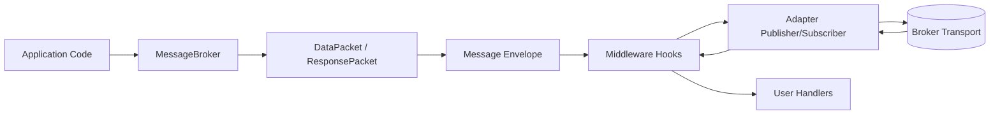

# message_broker

Async, transport-agnostic messaging framework for event processing, delayed delivery, and RPC-style request/response.

## Overview

message_broker provides a single API for working with different messaging backends. Application code interacts with MessageBroker, while adapters implement broker-specific behavior.

The framework focuses on operational concerns that are usually repeated in each service:

- message envelope validation
- retry behavior and timeout controls
- bounded consumer queues (backpressure)
- delayed delivery
- request-response correlation
- middleware hooks and observer integration

## Features

- Async-first API built on asyncio
- Transport abstraction with pluggable adapters
- Built-in message envelopes with Pydantic validation
- Fire-and-forget and RPC workflows
- Delayed delivery support
- Backpressure controls through bounded consumer queues
- Retry/timeouts for transport and handler execution
- Middleware and observer extension points
- Plugin-based adapter discovery via registry

## Installation

```bash
pip install 'git+https://github.com/SanjitKamath/Message_Broker.git'

or if you wish to install with Open Telemtry

pip install 'git+https://github.com/SanjitKamath/Message_Broker.git#egg=message_broker[otel]'
```

## Quick Start

```python
import asyncio
from message_broker import MessageBroker


async def main() -> None:
  broker = MessageBroker("redis://localhost:6379", queue_name="jobs")

  @broker.on_message
  async def handle(packet):
    print("received:", packet.content)
    return {"ok": True}

  await broker.connect()

  run_task = asyncio.create_task(broker.start())
  await broker.send_message(content={"job": "sync"}, sender="example-client")

  await asyncio.sleep(1)
  run_task.cancel()
  try:
    await run_task
  except asyncio.CancelledError:
    pass


if __name__ == "__main__":
  asyncio.run(main())
```

## Core Concepts Explained

1. Startup lifecycle:
   create MessageBroker -> connect() -> register handlers -> start()
2. Send path:
   send_message()/send_and_wait() builds a DataPacket, wraps it into a Message, applies before_publish middleware, then publishes through the adapter.
3. Receive path:
   adapter receives payload -> deserializes to Message -> applies after_consume middleware -> broker validates DataPacket -> user handler executes.
4. Reply path:
   if reply_to is present, handler output is wrapped in ResponsePacket and published to the reply queue.
5. Correlation:
   correlation_id is generated or propagated and used for tracing plus RPC response matching.

## API Reference

### High-Level API

| Method | Input | Output | Description | When to use |
| ------ | ----- | ------ | ----------- | ----------- |
| MessageBroker(connection_uri, queue_name="default_queue", **context_options) | URI, default queue, context options | MessageBroker instance | Creates broker facade and resolves adapter from URI scheme. | Every application entry point. |
| connect() | None | None | Opens transport connection and initializes publisher/subscriber. | Before publishing/subscribing. |
| start() | None | None (long-running) | Subscribes to message and reply queues, then keeps consume loop alive. | Consumer services and workers. |
| disconnect() | None | None | Cancels active tasks, resolves pending RPC waiters, and closes transport resources. | Graceful shutdown or service stop. |
| send_message(content, sender, reply=False, deliver_at=None) | Payload, sender id, optional reply flag, optional datetime | correlation_id (str) | Publishes DataPacket to configured queue. | Fire-and-forget and one-way events. |
| send_and_wait(content, sender, timeout=None, deliver_at=None) | Payload, sender id, optional timeout seconds, optional datetime | ResponsePacket | Publishes request and waits for matching reply by correlation_id. | RPC-style request-response. |
| on_message(handler=None) | Handler or decorator usage | Adapter-facing wrapper function | Registers request handler for inbound DataPacket messages. | Main consumer logic. |
| on_reply(handler=None) | Handler or decorator usage | Adapter-facing wrapper function | Registers reply handler for inbound ResponsePacket messages. | Optional reply-side processing and RPC observability. |

### Handler Contracts

| Handler Type | Input | Return | Sync/Async Support |
| ------------ | ----- | ------ | ------------------ |
| Message handler (on_message) | DataPacket | Payload \| None | Supports both sync and async handlers. |
| Reply handler (on_reply) | ResponsePacket | None | Supports both sync and async handlers. |

Notes:

- Message handlers may return payload data. If the incoming packet has reply_to, that return value is published as a ResponsePacket.
- Returning None is valid, especially for fire-and-forget consumers.
- Reply handlers are typically used for side effects (logging, metrics, custom response handling).

## Usage Patterns

### 1. Fire-and-Forget

Use when the sender does not need an immediate response.

```python
await broker.send_message(
  content={"event": "invoice.created", "invoice_id": "inv_123"},
  sender="billing-service",
)
```

When to use:

- domain events
- audit/event streams
- asynchronous background triggers

### 2. Delayed Messaging

Use when work should be executed at or after a specific time.

```python
from datetime import datetime, timedelta, timezone

await broker.send_message(
  content={"task": "retry-payment", "order_id": "ord_77"},
  sender="scheduler",
  deliver_at=datetime.now(timezone.utc) + timedelta(seconds=30),
)
```

When to use:

- deferred retries
- scheduled notifications
- cooldown or delay windows

### 3. Request-Response (RPC)

Use when the caller must wait for a typed response.

```python
response = await broker.send_and_wait(
  content={"operation": "healthcheck"},
  sender="api-gateway",
  timeout=3.0,
)

print(response.status, response.content)
```

When to use:

- command validation requiring immediate result
- service orchestration with bounded timeout
- bridge flows where async transport backs sync APIs

## Architecture

The framework separates application-level packet handling from transport-level publish/consume primitives. Your code interacts with MessageBroker and handlers; adapters handle broker details.



What happens step-by-step:

- Application calls send_message or send_and_wait.
- Broker builds packet metadata (including correlation_id).
- Middleware before_publish runs.
- Adapter serializes and publishes to the transport.
- Subscriber receives and deserializes to Message.
- Middleware after_consume runs.
- Broker validates packet and invokes handler.
- If reply_to exists, handler result is published as ResponsePacket.

## Configuration

Configuration can come from URI query params, keyword arguments, config mapping, and environment overrides.

| Option | Type | Default | Description |
| ------ | ---- | ------- | ----------- |
| timeout | int (ms) | 5000 | Operation timeout for transport actions. |
| max_retries | int | 3 | Retry attempts for transport operations. |
| concurrency | int | 10 | Number of consumer workers per subscription. |
| max_queue_size | int | 100 | Internal bounded queue size for backpressure. |
| processing_timeout_ms | int \| None | None | Max time allowed for one handler execution. |
| handler_max_retries | int | 0 | Retry attempts for handler execution failures. |
| scheduler_lock_ttl_ms | int | 5000 | Scheduler lock TTL for delayed delivery coordination. |
| scheduler_batch_size | int | 100 | Batch size for scheduled message polling/moves. |
| idempotency_ttl_sec | int | 86400 | TTL for idempotency keys used during processing. |
| shutdown_drain_timeout_ms | int | 1500 | Grace period to drain queued work on shutdown. |
| default_dlq_topic | str \| None | None | Fallback dead-letter queue destination. |
| dlq_topics | dict[str, str] | {} | Per-topic dead-letter queue overrides. |
| observers | list[object] | [] | Observer hooks for publish/consume/retry telemetry. |
| middlewares | list[Middleware] | [] | Middleware chain for before/after message lifecycle hooks. |
| serializer | Serializer | JsonSerializer | Custom serializer implementation for payload encoding/decoding. |
| rabbitmq_delay_queue_prefix | str | broker.delay | Prefix used by RabbitMQ delayed queue strategy. |

Example:

```python
from message_broker import MessageBroker

broker = MessageBroker(
  "redis://localhost:6379?timeout=3000",
  queue_name="orders",
  concurrency=20,
  max_queue_size=500,
  handler_max_retries=2,
)
```

Environment override examples:

- MB_TIMEOUT=7000
- MB_MAX_RETRIES=5
- MB_REDIS_TIMEOUT=2000

## Middleware System

Middleware exists to keep cross-cutting behavior out of business handlers and adapters.

- before_publish(topic, message): runs before serialization/publish.
- after_consume(topic, message): runs after deserialize and before handler invocation.

Execution flow:

- Publish path: MessageBroker -> before_publish (in order) -> adapter publish
- Consume path: adapter receive -> deserialize -> after_consume (in order) -> user handler

If a middleware raises during publish, publish fails fast. If a middleware raises during consume, the framework logs/continues according to adapter flow so one middleware does not stop all consumption.

Small example:

```python
import time
from message_broker.src.core.interfaces import Middleware, Message


class TimingMiddleware(Middleware):
  async def before_publish(self, topic: str, message: Message) -> Message:
    message.metadata["submitted_at"] = time.time()
    return message

  async def after_consume(self, topic: str, message: Message) -> Message:
    started = message.metadata.get("submitted_at")
    if isinstance(started, (int, float)):
      message.metadata["queue_latency_ms"] = (time.time() - started) * 1000
    return message
```

## Extending the Framework

To add a new broker adapter:

1. Implement Broker, Publisher, and Subscriber contracts.
2. Reuse context serializer and middleware chain.
3. Register adapter factory with BrokerRegistry.register("scheme", factory).
4. Optionally expose as plugin entry point group message_broker.adapters.
5. Use URI scheme in MessageBroker("scheme://...").

Minimal registration example:

```python
from message_broker.src.core.registry import BrokerRegistry


BrokerRegistry.register("mybroker", lambda context: MyBroker(context))
```

## Folder Structure

```text
message_broker/
├── message_broker/
│   ├── src/
│   │   ├── adapters/
│   │   │   ├── __init__.py
│   │   │   ├── rabbit.py
│   │   │   └── redis.py
│   │   ├── core/
│   │   │   ├── context.py
│   │   │   ├── exceptions.py
│   │   │   ├── interfaces.py
│   │   │   ├── observability.py
│   │   │   ├── registry.py
│   │   │   ├── resilience.py
│   │   │   └── serializers.py
│   │   ├── app_logging.py
│   │   ├── broker.py
│   │   └── schema.py
│   └── __init__.py
├── pyproject.toml
├── requirements.txt
└── Readme.md
```

## Contributing / Notes for Maintainers

Contributing guidelines:

1. Keep adapter behavior transport-specific but contract-compatible.
2. Preserve async correctness and cancellation safety.
3. Add tests for retries, timeout boundaries, and shutdown behavior.
4. Document any new context options in this README.

Notes for maintainers:

- Adapter plug-in point: BrokerRegistry maps URI scheme/broker_name to factory functions.
- Middleware hooks are executed by EnforcingPublisher on publish and by subscribers during consume before user handlers.
- Registry lifecycle: create() triggers plugin discovery, then resolves from registered factories.
- Adding a new broker usually requires:
  implementing adapter classes, importing/registration in adapters package, optional plugin entry point, and coverage for connect/publish/subscribe/disconnect + delayed behavior.

Operational note:

- MessageBroker.start() is a long-running task. In services, run it in a managed task and cancel on shutdown to trigger graceful disconnect.