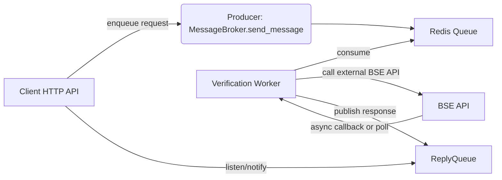

 message_broker — General-purpose async request/response queue

`message_broker` is a small, general-purpose Python package that provides a simple
request/response messaging abstraction on top of `FastStream` + Redis. It's
designed to be framework- and domain-agnostic: you can queue arbitrary JSON-like
payloads, process them asynchronously, and optionally receive typed responses.

Key goals:

- Strong typing and runtime validation via Pydantic models.
- Clear request/reply ergonomics for long-running or delayed tasks.
- Minimal, easily-importable API for integration into web servers or background workers.

## 📂 Project Layout

```text
message_broker
├── src/                  # package source root used for builds
│   ├── __init__.py
│   ├── app_logging.py
│   ├── broker.py
│   └── schema.py
├── pyproject.toml
└── Readme.md             # This document
```

---

## 🚀 Setup Instructions

### Prerequisites

* **Python 3.8+** installed.
* **Redis Broker** running locally on port `6379`.

### Windows Setup

1. **Install Redis:** You can run Redis natively via [Memurai](https://www.memurai.com/get-memurai) or use the official Linux version via WSL2 (`sudo apt install redis-server`).
2. **Open PowerShell** in your project directory.
3. **Create and activate a virtual environment:**
```powershell
python -m venv .venv
.\.venv\Scripts\Activate.ps1

```

4. **Install dependencies:**
```powershell
pip install -r requirements.txt

```


### Mac Setup

1. **Install Redis:** The easiest way is via Homebrew.
```bash
brew install redis
brew services start redis

```


2. **Open your Terminal** in your project directory.
3. **Create and activate a virtual environment:**
```bash
python3 -m venv .venv
source .venv/bin/activate

```


4. **Install dependencies:**
```bash
pip install -r requirements.txt

```


---

## ⚙️ How It Works

At a high level, the package provides:

- `MessageBroker` — a wrapper class that manages a FastStream app and Redis broker.
- `DataPacket` / `ResponsePacket` — Pydantic models that define the request/response envelopes.

The system uses a **Redis List** as a durable queue. Producers push `DataPacket`s
to the configured list; consumers subscribe and process messages one-by-one. If
a `reply_to` queue is provided in the `DataPacket`, the consumer publishes a
`ResponsePacket` back to that queue when processing completes.

This package also supports scheduled (delayed) delivery: when a `DataPacket`
includes a `deliver_at` UTC timestamp the producer will store the serialized
packet in a Redis Sorted Set named `{queue_name}_scheduled`. A background
scheduler (running in the broker process) atomically moves due messages from
the ZSET onto the primary Redis List so existing consumers process them
normally. This ensures reliable delayed delivery without blocking producers.

---

**Architecture diagram (sequence & components)**

```mermaid
flowchart LR
    Producer[Producer (web server / job dispatcher)] -->|push DataPacket| Redis[Redis List Queue]
    Redis -->|pop| Consumer[Consumer / Worker (FastStream)]
    Consumer -->|publish ResponsePacket| ReplyQueue[Reply Queue]
    ReplyQueue -->|deliver response| Producer
```

The producer may optionally attach a `reply_to` value. When set, the consumer
publishes a `ResponsePacket` to that queue containing `correlation_id` and the
`content` produced by the handler.

---

## Installation

Create a virtual environment and install dependencies:

```bash
python -m venv .venv
source .venv/bin/activate   # or .\\.venv\\Scripts\\Activate.ps1 on Windows
pip install -r requirements.txt
```

Make sure a Redis server is reachable at the `redis://` URL you pass to
`MessageBroker` (defaults in examples use `redis://127.0.0.1:6379`).

---

### Install as a package (optional)

You can install the project locally so other scripts/processes can `import message_broker`:

```bash
python -m pip install -e .
# or for a normal install
python -m pip install .
```

When installed, the project exposes console scripts (see `pyproject.toml`) so you can run the examples as commands: `mb-receiver` and `mb-messager`.


## Quick Start (examples)

Start a worker that consumes requests and replies:

```bash
python receiver.py
```

In another shell send a request and wait for reply:

```bash
python messager.py
```

Both example scripts import and use the package-level API:

- `from message_broker import MessageBroker, DataPacket, ResponsePacket`

If you installed the package you can also run the provided console scripts:

```bash
mb-receiver    # start worker (when installed)
mb-messager    # send request (when installed)
```

---

## API Reference — Parameters & Features

The following table summarizes the public API, accepted parameters, and behavior.

| Symbol | Type / Args | Description |
|---|---:|---|
| `MessageBroker(redis_url, queue_name='default_queue')` | constructor | Creates a broker instance bound to a Redis URL and queue name. Also creates a unique `reply_queue` for replies when requested. |
| `send_message(content, sender, reply=False, deliver_at=None)` | `content`: JSON-like; `sender`: str; `reply`: bool; `deliver_at`: Optional[datetime] | Publish a `DataPacket` to the broker queue. If `deliver_at` is provided the packet is scheduled into `{queue_name}_scheduled` and delivered when the timestamp is reached. Returns the `correlation_id` string. If `reply=True`, the instance reply queue is attached to the packet. |
| `on_message(handler)` | `handler`: callable `DataPacket -> Optional[Payload]` (sync or async) | Decorator to register a request handler. If the incoming packet has `reply_to`, the handler return value is sent back as `ResponsePacket.content`. |
| `on_reply(handler)` | `handler`: callable `ResponsePacket -> None` (sync or async) | Register a callback for replies on the instance reply queue. Useful for waiting for responses in requesters. |
| `DataPacket` model | fields: `id: str`, `sender: str`, `content: Payload`, `correlation_id: str`, `reply_to: Optional[str]`, `deliver_at: Optional[datetime]` | Request envelope. `content` is a JSON-like alias (`Payload`) for rich structured data. `id` and `correlation_id` default to UUID strings. `deliver_at` can be set to schedule delayed delivery. |
| `ResponsePacket` model | fields: `correlation_id: str`, `in_response_to: str`, `status: str`, `content: Optional[Payload]`, `processed_at: datetime` | Response envelope published back to the `reply_to` queue. `processed_at` is timezone-aware UTC.

Notes:

- Handlers may be synchronous or async — the package will `await` coroutine results when necessary.
- Consumers now always send an explicit failed response when a handler raises and the incoming packet included `reply_to`.
 - Consumers now always send an explicit failed response when a handler raises and the incoming packet included `reply_to`.
 - Scheduled delivery: packets with `deliver_at` are stored in a Redis Sorted Set named `{queue_name}_scheduled`. The broker runs a background scheduler that atomically pops due items and republishes them to the main list for processing.

Requirements note: this implementation uses the `redis` async client (`redis.asyncio`). Ensure `redis` is installed in your environment (added to `requirements.txt`).

---

## Real-world Example: Government Account Opening (BSE)

Scenario: A web API accepts account opening requests which the external regulator (BSE) processes asynchronously and can take from 30 minutes to multiple days to respond. You don't want your API threads to block while waiting.

Sequence:



Implementation notes:

- The API handler constructs a `DataPacket` with `content` containing applicant data and a `reply=True` so the originating API server can listen for the result.
- The worker may call the BSE API and either poll or receive a webhook/callback. When BSE responds (hours/days later), the worker publishes a `ResponsePacket` with the verification result.
- The API server can then notify the original user via websocket, email, or by letting the client poll a status endpoint which reads latest responses from a persistence store indexed by `correlation_id`.

This pattern keeps web requests non-blocking and provides strong typing for the payload exchanged between services.

---

## Contributing & Notes

- The package is intentionally small and framework-agnostic. If you need guaranteed-delivery semantics across restarts, consider combining Redis Lists with an external persistence store and deduplication by `id`/`correlation_id`.
- For production, pin dependency versions in `requirements.txt` or use a lockfile.

---

If you'd like, I can also:

1. Add a small `examples/` folder with a ready-to-run web API that enqueues requests.
2. Produce unit tests for the `MessageBroker` behaviour (handlers, reply routing, failure responses).

---

Read the code in `message_broker/` for full type definitions and docstrings.


